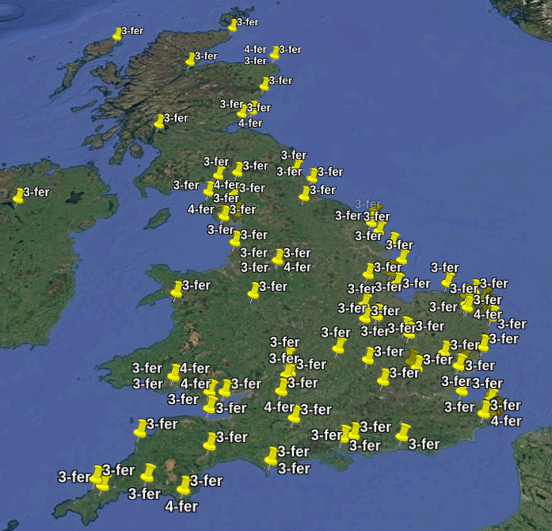
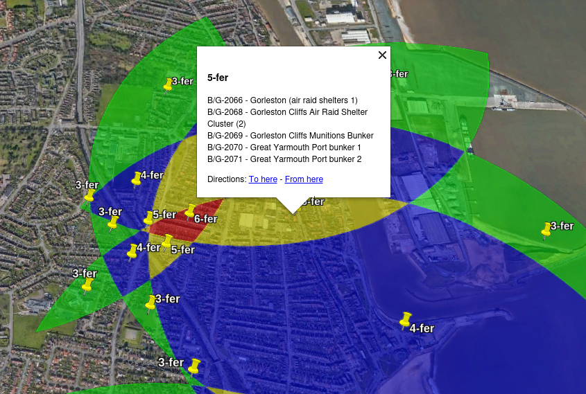

# UKBOTA n-fer finder

Finds multiple bunker activation zone overlaps in the UKBOTA programme. Based on my ["Worked Everything, Everywhere, All at Once" script](https://github.com/ianrenton/weeaaoa), restricted to only a single UKBOTA bunkers CSV, but adds KML export for >=3fers.

3-fers are shown in green in the KML output, 4-fers in blue and 5-fers are shown in yellow. 

Regions that are a 6-fer or more are shown in red - *please note that the UKBOTA rules do not allow activating more than 5 bunker references at a time*, so if you activate in these areas, you must pick your favourite 5.

 

Note that the Public Domain licence applies only to the Python code. UKBOTA bunker data is owned by the UKBOTA programme and subject to its own licence.

## Usage

If you just want to see the current results as of May 2025, the `output.kml` that this script produces has been checked into the repo to avoid you having to re-run the script for yourself. Just [download that](https://github.com/ianrenton/ukbota-nfer-finder/raw/refs/heads/main/output.kml) and go.

If you want to run the script for yourself with updated data, or to tweak things, read on.

Usage with `venv` and `pip` on Linux is recommended, but it will work fine wherever you use Python and however you like to manage it.

A complete setup example for Debian & derivatives such as Ubuntu:

```bash
sudo apt install python3 python3-pip python3-venv
git clone https://github.com/ianrenton/ukbota-nfer-finder.git
cd ukbota-nfer-finder
python3 -m venv .venv
source .venv/bin/activate
pip install -r requirements.txt
```

Then, download the latest UKBOTA CSV list from https://bunkersontheair.org/site/files/ to your computer. Edit `ukbota-nfer-finder.py` and set the value of the `BUNKERS_FILE_PATH` variable to point to the file you downloaded.

You can then run the script with `python3 ukbota-nfer-finder.py`.

Once it has finished, you can open the resulting `output.kml` in [Google Earth Pro](https://www.google.com/intl/en_uk/earth/about/versions/#download-pro) (desktop), [Google Earth](https://earth.google.com/web/) (web) or another KML viewer of your choice.